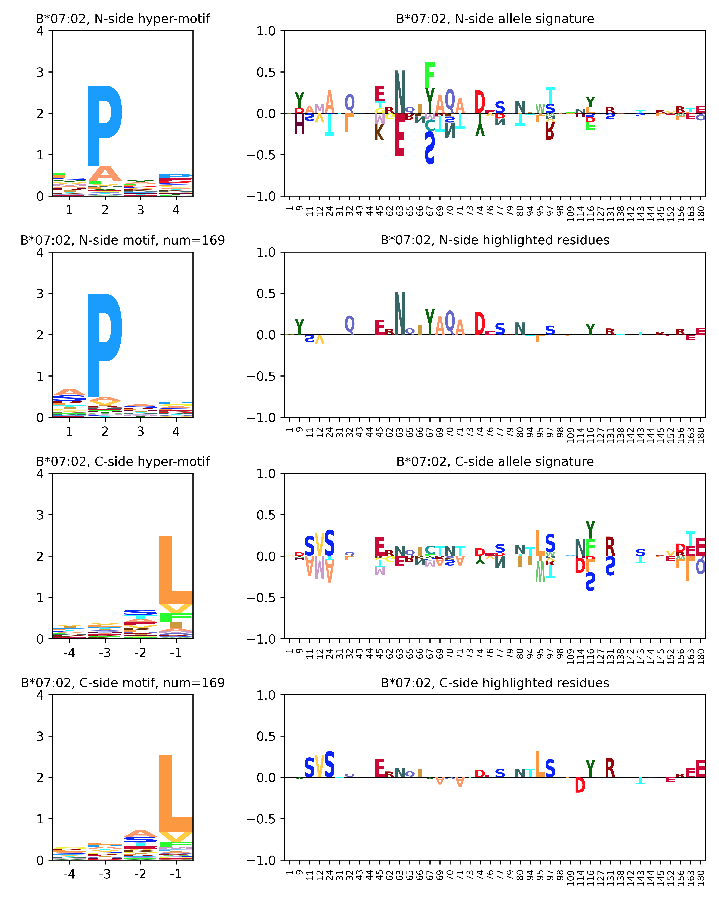

# MHCfovea

MHCfovea is a pan-allele MHC-I-peptide binding predictor which takes MHC-I alleles and peptide sequences to predict the binding probability within 0 and 1. Our predictor is a convolution-based model trained on both binding assay data and ligand elution data from IEDB database. For MHC-I molecules, we use the peptide-binding cleft which is a 182-amino-acid long sequence composed of α-1 and α-2 regions as the encode of MHC-I alleles. As for peptides, any sequence within 8 to 15 amino acids long is available.

Model Architecture:

<p align="center"></p>


In addition to binding prediction, MHCfovea provides an interpretation of the relation between MHC-I sequences and epitop-binding motifs. We apply ScoreCAM on our model to select important positions of MHC-I sequences, and expand unobserved alleles by prediction to build clusters of MHC-I-peptide binding. Each HLA group on 2-digit level (eg. A*01) has 50 alleles maximally during the process of allele expansion. Only alleles in the expansion list is available for interpretation. The cluster contains a hyper-motif, representing the preference of epitope binding, and an allele signature, representing the pattern of MHC-I sequences. For each queried allele, the epitope-binding motif and highlighted MHC-I residues are reported. The epitope-binding motif is calculated from the input file, and the highlighted residues are consensus residues of the queried allele and allele signature.

Interpretation clusters of HLA-B:

<p align="center"></p>

If you find MHCfovea useful in your research please cite:


## Installation
1. Python3 is required
2. Download/Clone MHCfovea
```
git clone https://github.com/kohanlee1995/MHCfovea.git
cd MHCfovea
```
3. Install reqiured package
```
pip3 install -r requirements.txt
```

## Usage
```
usage: predictor [-h] [--alleles ALLELES] [--motif_threshold MOTIF_THRESHOLD]
                 [--get_metrics]
                 input output_dir

    MHCfovea, an MHCI-peptide binding predictor. In this prediction process, GPU is recommended.

    Having two modes:
    1. specific mode: each peptide has its corresponding MHC-I allele in the input file; column "mhc" or "allele" is required
    2. general mode: all peptides are predicted with all alleles in the "alleles" argument

    Input file:
    only .csv file is acceptable
    column "sequence" or "peptide" is required as peptide sequences
    column "mhc" or "allele" is optional as MHC-I alleles

    Output directory contains:
    1. prediction.csv: with new column "score" for specific mode or [allele] for general mode
    2. interpretation: a directory contains interpretation figures of each allele with more than 10 positive predictions
    3. metrics.json: all and allele-specific metrics (AUC, AUC0.1, AP, PPV); column "bind" as benchmark is required


positional arguments:
  input                 The input file
  output_dir            The output directory

optional arguments:
  -h, --help            show this help message and exit
  --alleles ALLELES     alleles for general mode
  --motif_threshold MOTIF_THRESHOLD
                        prediction threshold for epitope-binding motifs, default=0.9
  --get_metrics         calculate the metrics between prediction and benchmark
```


## Example

```
python3 mhcfovea/predictor.py example/input.csv example/output
```

#### input file

| sequence | mhc |
|---|---|
| NAPWAVTSL | B*07:02 |
| VNLPINGNGKQ | B*07:02 |
| RVAEFHTEL | B*07:02 |
| AAAGPGAAL | B*07:02 |
| APAAIPAL | B*07:02 |
| APAAYPREVAL | B*07:02 |
| APAGGAGAL | B*07:02 |
| APAGSIISL | B*07:02 |
| APAPGAPLL | B*07:02 |
| APAPGAPLLPL | B*07:02 |
| APAPSRGSVQV | B*07:02 |
| APAPSRGSVQVAL | B*07:02 |
| APFGLKPRSV | B*07:02 |
| APFLRIAF | B*07:02 |
| APGDYGRQAL | B*07:02 |
| APGEPGSAF | B*07:02 |
| APGGGPGTL | B*07:02 |
| APGPGLLL | B*07:02 |
| APHDYGLIL | B*07:02 |
| APHPSSWETL | B*07:02 |

#### output file

| sequence | mhc | score |
|---|---|---|
| NAPWAVTSL | B*07:02 | 0.919 |
| VNLPINGNGKQ | B*07:02 | 0.968 |
| RVAEFHTEL | B*07:02 | 0.94 |
| AAAGPGAAL | B*07:02 | 0.959 |
| APAAIPAL | B*07:02 | 0.979 |
| APAAYPREVAL | B*07:02 | 0.997 |
| APAGGAGAL | B*07:02 | 0.998 |
| APAGSIISL | B*07:02 | 0.997 |
| APAPGAPLL | B*07:02 | 0.999 |
| APAPGAPLLPL | B*07:02 | 0.999 |
| APAPSRGSVQV | B*07:02 | 0.994 |
| APAPSRGSVQVAL | B*07:02 | 0.992 |
| APFGLKPRSV | B*07:02 | 0.961 |
| APFLRIAF | B*07:02 | 0.913 |
| APGDYGRQAL | B*07:02 | 0.995 |
| APGEPGSAF | B*07:02 | 0.986 |
| APGGGPGTL | B*07:02 | 0.983 |
| APGPGLLL | B*07:02 | 0.943 |
| APHDYGLIL | B*07:02 | 0.973 |
| APHPSSWETL | B*07:02 | 0.989 |

#### interpretation figure
In highlighted residues figures, the value of amino acids above 0 means the allele has those positive residues. In contrast, the value below 0 means the allele has  those negative residues which do not support the interpretation.

<p align="center"></p>
