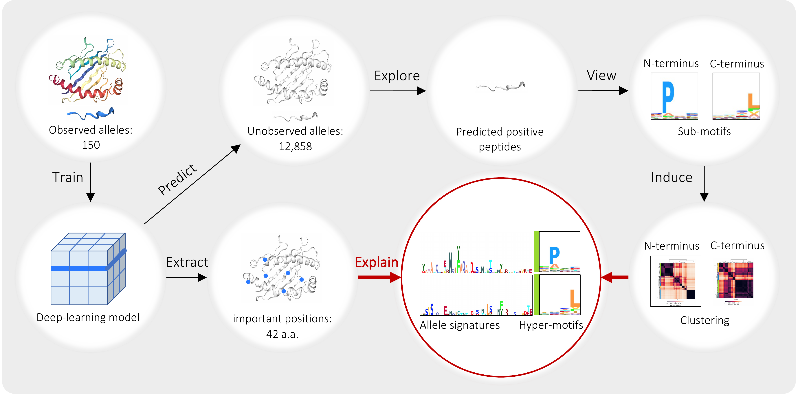

# MHCfovea

MHCfovea integrates a supervised prediction module and an unsupervised summarization module to connect important residues to binding motifs.

## Overview

First, the MHCfovea's predictor was trained on 150 observed alleles; 42 important positions were highlighted from MHC-I sequence (182 a.a.) using ScoreCAM. Next, we made predictions on 150 observed and 12,858 unobserved alleles against a peptide dataset (number: 254,742), and extracted positive predictions (score > 0.9) to generate the binding motif of an allele. Finally, after clustering the N- and C-terminal sub-motifs, we built hyper-motifs and the corresponding allele signatures based on 42 important positions to reveal the relation between binding motifs and MHC-I sequences.

The resultant pairs of hyper-motifs and allele signatures can be easily queried through a web interface (https://mhcfovea.ailabs.tw)

<p align="center"></p>

## Application

MHCfovea takes MHC-I alleles (all alleles in the IPD-IMGT/HLA database (version 3.41.0) are available) and peptide sequences as inputs to predict the binding probability. For each queried allele, MHCfovea provides the cluster information and allele information of N- and C-terminal clusters respectively.

- cluster information
  - hyper-motif: the pattern of binding peptides in a specific cluster
  - allele signature: the pattern of MHC-I alleles in a specific cluster
- allele information
  - sub-motif: the binding sub-motif of the queried allele
  - highlighted allele signature: the consensus residues of the allele signature and the queried allele

If you find MHCfovea useful in your research please cite:
```bibtex
@article {MHCfovea_2021,
title   = {Connecting {MHC}-{I}-binding motifs with {HLA} alleles via deep learning},
author  = {Lee, Ko-Han and Chang, Yu-Chuan and Chen, Ting-Fu and Juan, Hsueh-Fen and Tsai, Huai-Kuang and Chen, Chien-Yu},
journal = {Communications Biology},
year    = {2021},
volume  = {4},
number  = {1},
pages   = {1194},
doi     = {10.1038/s42003-021-02716-8},
issn    = {2399-3642}
}
```


## Installation
1. Python3 is required
2. Download/Clone MHCfovea
```
git clone https://github.com/kohanlee1995/MHCfovea.git
cd MHCfovea
```
3. Install reqiured package
```
pip3 install -r requirements.txt
```

## Usage
```
usage: predictor [-h] [--alleles ALLELES] [--get_metrics] input output_dir

    MHCfovea, an MHCI-peptide binding predictor. In this prediction process, GPU is recommended.

    Having two modes:
    1. specific mode: each peptide has its corresponding MHC-I allele in the input file; column "mhc" or "allele" is required
    2. general mode: all peptides are predicted with all alleles in the "alleles" argument

    Input file:
    only .csv file is acceptable
    column "sequence" or "peptide" is required as peptide sequences
    column "mhc" or "allele" is optional as MHC-I alleles

    Output directory contains:
    1. prediction.csv: with new column "score" for specific mode or [allele] for general mode
    2. interpretation: a directory contains interpretation figures of each allele
    3. metrics.json: all and allele-specific metrics (AUC, AUC0.1, AP, PPV); column "bind" as benchmark is required


positional arguments:
  input              The input file
  output_dir         The output directory

optional arguments:
  -h, --help         show this help message and exit
  --alleles ALLELES  alleles for general mode
  --get_metrics      calculate the metrics between prediction and benchmark
```


## Example

```
python3 mhcfovea/predictor.py example/input.csv example/output
```

#### input file

| sequence | mhc |
|---|---|
| PVPTYGLSV | B*07:02 |
| APGARNTAAVL | B*07:02 |
| SPAPPTCHEL | B*07:02 |
| PGLAVKELK | B*07:02 |
| GPMVAGGLL | B*07:02 |

#### output file

| sequence | mhc | score | %rank |
|---|---|---|---|
| PVPTYGLSV | B*07:02 | 0.606 | 0.616 |
| APGARNTAAVL | B*07:02 | 0.987 | 0.015 |
| SPAPPTCHEL | B*07:02 | 0.997 | 0.004 |
| PGLAVKELK | B*07:02 | 0.569 | 0.692 |
| GPMVAGGLL | B*07:02 | 0.966 | 0.024 |

#### interpretation figure

<p align="center"></p>


## Development

The folder of development contains all source codes for the development of MHCfovea. The following is the description of these files.
- build_dataset.py: for building training, validation, and benchmark dataset
- util.py: utility functions for data analysis
- trainer.py: for the training process
- model.py: the model architecture
- BA.py: utility functions for training process
- predictor.py: for the prediction process
- cam.py: functions for CAM algorithm
- cam_run.py: for the CAM process
- run_pan_allele.py: for the prediction on all HLA alleles
- CAMInterp.py: utility functions for the interpretation of ScoreCAM results
- MHCInterp.py: utility functions for the summarization

[Tutorial](development/README.md)
